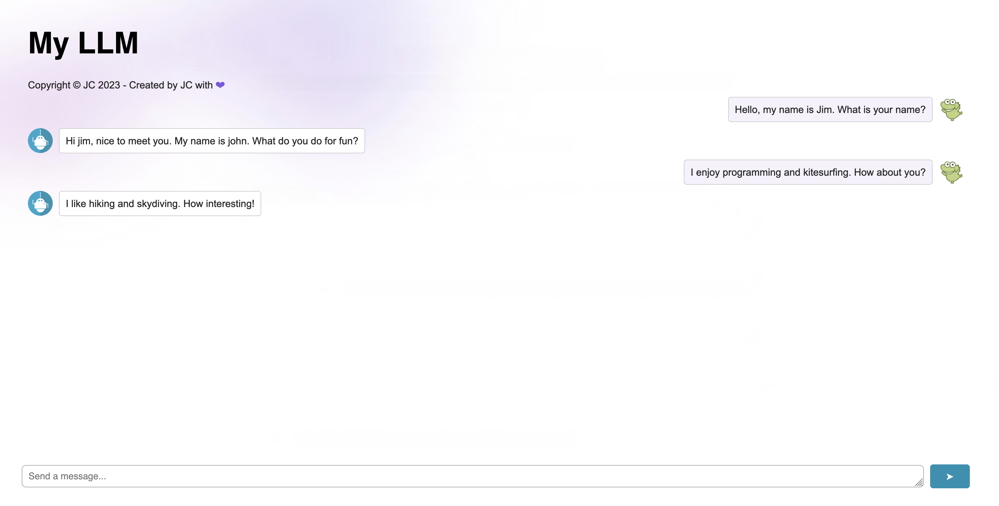

# IBM LLM Application Chatbot

A conversational AI chatbot web application built with Flask and Facebook's BlenderBot model, developed as part of IBM's AI/LLM course on Cognitive Class.



## Overview

This project integrates a large language model (LLM) into a full-stack web application. The backend is powered by a Flask server that processes user messages through Facebook's BlenderBot-400M model and returns AI-generated responses to the frontend chat interface.

## Features

- Real-time chat interface
- Conversational memory (tracks conversation history)
- Flask REST API backend
- Responsive web UI

## Technologies Used

- **Python** / **Flask** — backend server
- **flask-cors** — handles cross-origin requests
- **Hugging Face Transformers** — loads and runs the LLM
- **Facebook BlenderBot-400M-Distill** — the conversational AI model
- **JavaScript** — frontend chat interface
- **HTML/CSS** — webpage styling

## Project Structure

```
LLM_application_chatbot/
├── app.py
├── requirements.txt
├── static/
│   ├── script.js
│   └── (other assets)
└── templates/
    └── index.html
```

## Installation

1. Clone the repository:
```bash
git clone https://github.com/awjenson/IBM_LLM_application_chatbot.git
cd IBM_LLM_application_chatbot
```

2. Install dependencies:
```bash
python3.11 -m pip install -r requirements.txt
```

## Running the App

```bash
flask run
```

The server will start at `http://127.0.0.1:5000`. Open that URL in your browser to use the chatbot.

> **Note:** On first run, the BlenderBot model (~730MB) will be downloaded automatically. Subsequent runs will use the cached version.

## How It Works

1. The user types a message in the web interface and hits send
2. The JavaScript frontend sends a POST request to the `/chatbot` endpoint
3. Flask receives the prompt and passes it — along with conversation history — to the BlenderBot model
4. The model generates a response, which is returned to the frontend and displayed in the chat

## API Endpoint

**POST** `/chatbot`

Request body:
```json
{
  "prompt": "Hello, how are you today?"
}
```

Response:
```
I am doing very well today. I am glad to hear you are doing well.
```

## Acknowledgements

- Built as part of the [IBM AI Developer course](https://cognitiveclass.ai/) on Cognitive Class
- Template frontend provided by [IBM Developer Skills Network](https://github.com/ibm-developer-skills-network/LLM_application_chatbot)
- BlenderBot model by [Facebook AI](https://huggingface.co/facebook/blenderbot-400M-distill)
